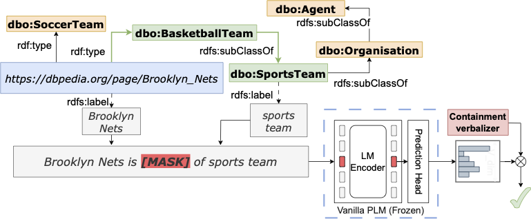

# (Submitted to ISWC 2024) PRONTO: Prompt-based Detection of Semantic Containment Patterns in MLMs

Reference code for paper "PRONTO: Prompt-based Detection of Semantic Containment Patterns in MLMs" (Submitted at ISWC 2024-Research Track). This work investigates whether MLMs can model the semantic containment relationship (is-a/subclass-of) presenting a novel approach to automatically leverage the predictions heads of MLMs to discover semantic containment relations in unstructured text.

## Introduction to PRONTO

Masked Language Models (MLMs) like BERT and RoBERTa excel at predicting missing words based on context, but their ability to understand deeper semantic relationships is still being assessed. 
While MLMs have demonstrated impressive capabilities, it is still unclear if they merely exploit statistical word co-occurrence or if they can capture a deeper, structured understanding of meaning, similar to how knowledge is organized in ontologies. This is a topic of increasing interest, with researchers seeking to understand how MLMs might internally represent concepts like ontological classes and semantic containment relations (e.g., *sub-class* and *instance-of*). Unveiling this knowledge could have significant implications for Semantic Web applications, but it necessitates a profound understanding of how these models express such relationships.
This work investigates whether MLMs can understand these relationships, presenting a novel approach to automatically leverage the predictions returned by MLMs to discover semantic containment relations in unstructured text. We achieve this by constructing a *verbalizer*, a system that translates the model's internal predictions into classification labels. Through a comprehensive probing procedure, we assess the method's effectiveness, reliability, and interpretability. Our findings demonstrate a key strength of MLMs: their ability to capture semantic containment relationships. These insights bring significant implications for MLM application in ontology construction and aligning text data with ontologies.



PRONTO Schematization: given a pair representing a containment in a reference taxonomy, representing a semantic containment relationship ("is-a"),  PRONTO predicts the plausibility of the pair with a learned verbalizer.


## Dependencies and Installation

-   Python >= 3.10.12
-   [PyTorch >= 2.2.1](https://pytorch.org/)
-   CUDA 12.1

### Installation

1.  Clone repo
    ```
    git clone https://github.com/masked_until_acceptance.git
    cd PRONTO
    ```
2.  Install dependent packages
	```
	# Create virtual environment
	python -m venv venv
	. ./venv/bin/activate
	# Install requirements
	pip install -r requirements.txt    
	```

## Replicating the experiments

1. To replicate our results on the paper, run `python run_model_train.py` for each of the experiments related to semantic containment prediction (Tables 4,7, and 8).

    **Warning**: Define the customizable variables (see below) according to the details of the experiment to run.

	```
	python run_model_train.py

	```

2. To replicate our results on zero-shot entity typing task, run the following command:
	**Warning**: it requires a verbalizer checkpoint resulting from `run_model_train.py`.

	```
	python run_fewnerd.py

	```

*Note*: we noticed that results may slightly vary according to the underlying
hardware architecture. Our experiments were run on a NVIDIA GeForce RTX 3090
(24GB), Intel(R) Core(TM) i7-5820K CPU @ 3.30GHz.


### Script Arguments

- Line arguments for `run_model_train.py`:

	**Warning**: Custom templates (different from the ones in the paper) need to be specified directly in the script, as well as soft tokens.

```plaintext
--verbalizer_type        str   default="mav"     choices=["mav", "vf", "lin", "ws"]   The type of verbalizer to use.
--model_name             str   default="test_model"                                 The name of the output model.
--pretrained_model_name  str   default="FacebookAI/roberta-base"                    The name of the pretrained model to use.
--no_save_models         flag  store_false                                          Whether to save the models.
--no_save_results        flag  store_false                                          Whether to save the results.
--load_models            flag  store_true                                           Whether to load existing models.
--no_train_models        flag  store_false                                          Whether to train the models.
--with_context           flag  store_true                                           Whether to use textual descriptions.
--reversed_test          flag  store_true                                           Whether to perform the positive-reverse negatives test.
--unseen_instances       float default=0                                            Percentage of instances in the test set to drop associated triples from the train set.
--epochs                 int   default=50                                           Number of training epochs.
--batch_size             int   default=64                                           Batch size for training.
--alpha                  float default=0.8                                          Alpha parameter value for the focal loss.
--weight_decay           float default=1e-6                                         Weight decay value.
--learning_rate          float default=1e-5                                         Learning rate.
--l1_reg                 float default=0                                            L1 regularization value.
--noise_scaling          float default=0                                            Noise scaling value (DEPRECATED).

```


- Line arguments for `run_fewnerd.py`:

	**Warning**: to test different prompt templates, it is required to customize the TEMPLATE variable in the script (and SPECIAL_TOKENS if needed). By default, the script uses the "[1] is [MASK] of [2]" prompt template (h_1 in the paper), which has template_id 0 by default in the run_model_train.py script.

```plaintext
--verbalizer_type        str   default="mav"          choices=["mav", "vf", "lin", "ws"]   The type of verbalizer to use.
--model_name             str   default="test_model"                                      The name of the saved verbalizer model (trained with run_model_train.py).
--results_name           str   default="results"                                         The name of the experiment.
--pretrained_model_name  str   default="FacebookAI/roberta-large"                        The name of the pretrained model to use.
--template_id            int   default=0                                                 The zero-indexed ID of the prompt template to use.
--experiment_type        str   default="coarse"       choices=["coarse", "per", "loc", "org"]   The type of experiment to run.


```


### Commands to Reproduce the Experiments

**Warning**: the following commands are based on the RoBERTa-Large model. In order to test the other models, specify the respective huggingface name with the `--pretrained_model_name` argument ("FacebookAI/roberta-base" or "bert-base-cased" are also supported).

* Running Pronto-MAV training with RoBERTa-Large:

	``` 
	python run_model_train.py --model_name="pronto-mav-roberta" --pretrained_model_name="FacebookAI/roberta-large" --verbalizer_type="mav"
	```

  * Running Few-NERD evaluation (coarse) with the resulting model (**Warning**: the NER split can be specified with the `--experiment_type` argument):

      ``` 
      python run_fewnerd.py --experiment_type="coarse" --model_name="pronto-mav-roberta" --pretrained_model_name="FacebookAI/roberta-large" --verbalizer_type="mav"
      ```
    
  * Running Pronto-MAV evaluation with node descriptions with RoBERTa-Large (after training):
      
      ``` 
      python run_model_train.py --model_name="pronto-mav-roberta" --pretrained_model_name="FacebookAI/roberta-large" --verbalizer_type="mav" --with_context --no_save_results --load_models --no_train_models
      ```
    
  * Running Pronto-MAV training with RoBERTa-Large (80% entities of test set removed from train set):
      
      ``` 
      python run_model_train.py --model_name="pronto-mav-roberta-unseen" --pretrained_model_name="FacebookAI/roberta-large" --verbalizer_type="mav" --unseen_instances=0.80
      ```

* Running Pronto-VF training with RoBERTa-Large:

   ``` 
   python run_model_train.py --model_name="pronto-vf-roberta" --pretrained_model_name="FacebookAI/roberta-large" --verbalizer_type="vf"
   ```
  
* Running Pronto-WS training with RoBERTa-Large:

   ``` 
   python run_model_train.py --model_name="pronto-ws-roberta" --pretrained_model_name="FacebookAI/roberta-large" --verbalizer_type="ws" --learning_rate=1e-1 --l1_reg=1e-4 --weight_decay=0
   ```

	* Running Pronto-WS evaluation with RoBERTa-Large on reverse negatives (after training):

	   ``` 
	   python run_model_train.py --model_name="pronto-ws-roberta" --pretrained_model_name="FacebookAI/roberta-large" --verbalizer_type="ws" --reversed_test --load_models --no_train_models
	   ```
   
* Running Pronto-LIN training with RoBERTa-Large:

   ``` 
   python run_model_train.py --model_name="pronto-lin-roberta" --pretrained_model_name="FacebookAI/roberta-large" --verbalizer_type="lin" --learning_rate=1e-1 --l1_reg=1e-4 --weight_decay=0
   ```
  

  
## License
This source code is released under the Apache 2.0 license.

## Citation
`The details will be released upon acceptance`

## Contact
If you have any question, please email `masked email until acceptance`.
